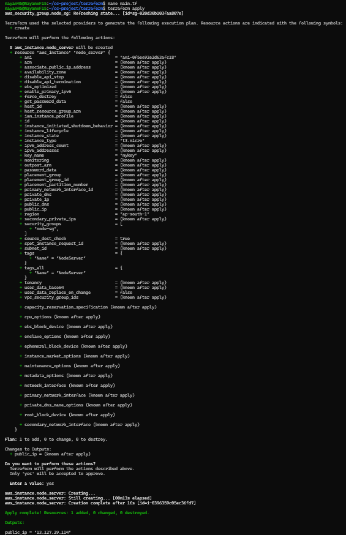
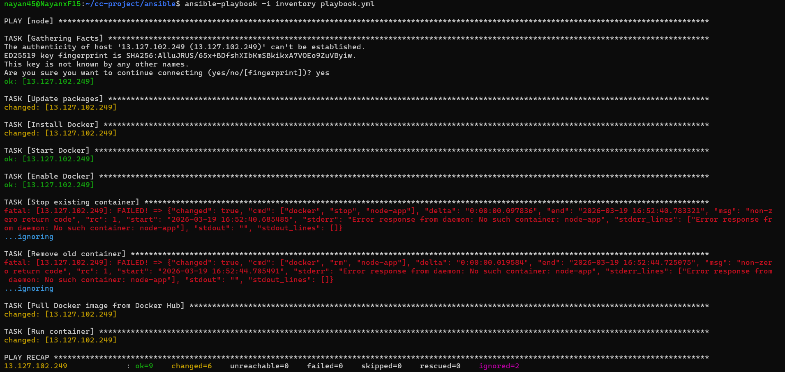
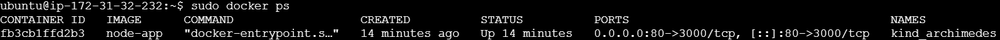
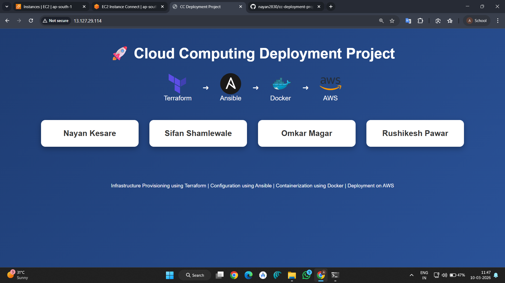

# 🚀 CC Deployment Project

**Terraform • Ansible • Docker • AWS EC2**

---

# 📌 Project Overview

This project demonstrates a complete DevOps workflow for deploying a **Node.js web application on AWS infrastructure** using modern DevOps tools.

The infrastructure is provisioned using **Terraform**, server configuration is automated using **Ansible**, and the application is **containerized with Docker** before being deployed on an **AWS EC2 instance**.

This project showcases **Infrastructure as Code (IaC)**, **automation**, and **containerization** as part of a cloud deployment pipeline.

---

# 🌐 Live Deployment

The application is successfully deployed on an **AWS EC2 instance** and can be accessed at:

```
http://13.127.29.114
```

The Node.js application runs inside a **Docker container** on an EC2 server provisioned using **Terraform** and configured using **Ansible**.

---

# 🧰 Technologies Used

| Tool | Purpose |
|-----|--------|
| **AWS EC2** | Cloud infrastructure to host the application |
| **Terraform** | Infrastructure provisioning (IaC) |
| **Ansible** | Server configuration automation |
| **Docker** | Application containerization |
| **Node.js** | Web application runtime |
| **Git & GitHub** | Version control and project hosting |
| **WSL (Ubuntu)** | Local development environment |

---

# 📋 Prerequisites

Make sure the following tools are installed on your system before running this project:

- Terraform
- Ansible
- Docker
- AWS CLI configured with credentials
- Git
- WSL / Linux environment

---

# 🏗 Project Architecture

```
Developer Machine (WSL / Linux)
            │
            │ Terraform
            ▼
AWS Infrastructure
(EC2 Instance + Security Group)
            │
            │ Ansible
            ▼
Docker Installed on EC2
            │
            ▼
Docker Container
            │
            ▼
Node.js Web Application
            │
            ▼
User Browser (Public IP)
```

---

# 📂 Project Structure

```
cc-deployment-project
│
├── terraform
│   └── main.tf
│
├── ansible
│   ├── inventory
│   └── playbook.yml
│
├── node-app
│   ├── server.js
│   ├── package.json
│   └── Dockerfile
│
├── screenshots
│
├── .gitignore
└── README.md
```

---

# ⚙️ Setup Instructions

## 1️⃣ Clone the Repository

```bash
git clone https://github.com/nayan2830/cc-deployment-project.git
cd cc-deployment-project
```

---

# 🌍 Step 1 — Provision Infrastructure using Terraform

Navigate to Terraform folder:

```bash
cd terraform
```

Initialize Terraform:

```bash
terraform init
```

Apply configuration:

```bash
terraform apply
```

Terraform will create:

- AWS EC2 Instance
- Security Group
- Networking rules

---

# ⚙️ Step 2 — Configure Server using Ansible

Navigate to Ansible folder:

```bash
cd ../ansible
```

Run playbook:

```bash
ansible-playbook -i inventory playbook.yml
```

This installs:

- Docker
- Required system packages

---

# 🐳 Step 3 — Dockerize the Application

Navigate to Node application:

```bash
cd ../node-app
```

Build Docker image:

```bash
docker build -t node-app .
```

Run container:

```bash
docker run -d -p 80:3000 node-app
```

This maps:

```
EC2 Port 80 → Node.js Application Port 3000
```

---

# 🌐 Step 4 — Access the Application

Open your browser and visit:

```
http://13.127.29.114
```

You should see the **DevOps Team Webpage** displaying team member cards.

---

# 📸 Project Screenshots

### Terraform Infrastructure Creation



---

### Ansible Configuration Automation



---

### Docker Container Running on EC2



---

### Deployed Web Application



---

# 👨‍💻 Team Members

- **Nayan Kesare**
- **Sifan Shamlewale**
- **Omkar Magar**
- **Rushikesh Pawar**

---

# 📊 DevOps Workflow Implemented

✔ Infrastructure Provisioning using **Terraform**  
✔ Infrastructure as Code (**IaC**)  
✔ Server Configuration using **Ansible**  
✔ Application Containerization using **Docker**  
✔ Cloud Deployment on **AWS EC2**

---

# 🎯 Learning Outcomes

Through this project we learned:

- Infrastructure automation using Terraform
- Configuration management with Ansible
- Containerization using Docker
- Cloud deployment on AWS
- Building a complete DevOps deployment pipeline

---

# 📜 License

This project was developed for **academic and learning purposes**.
