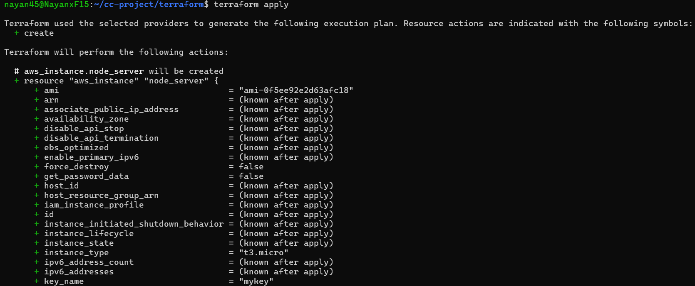
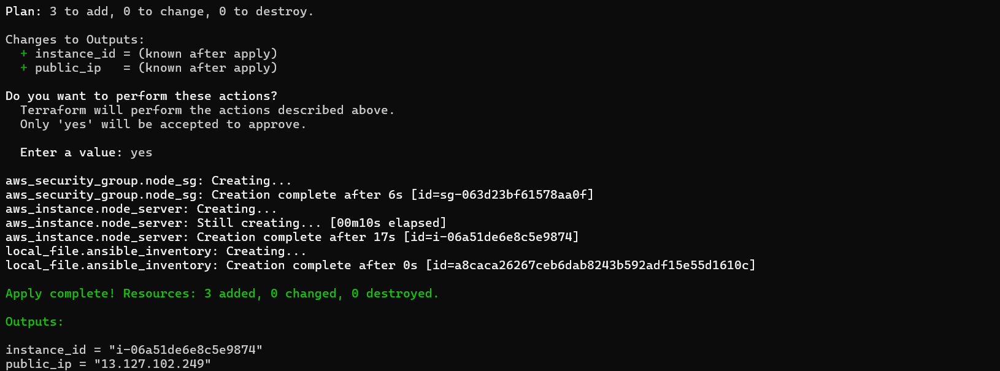
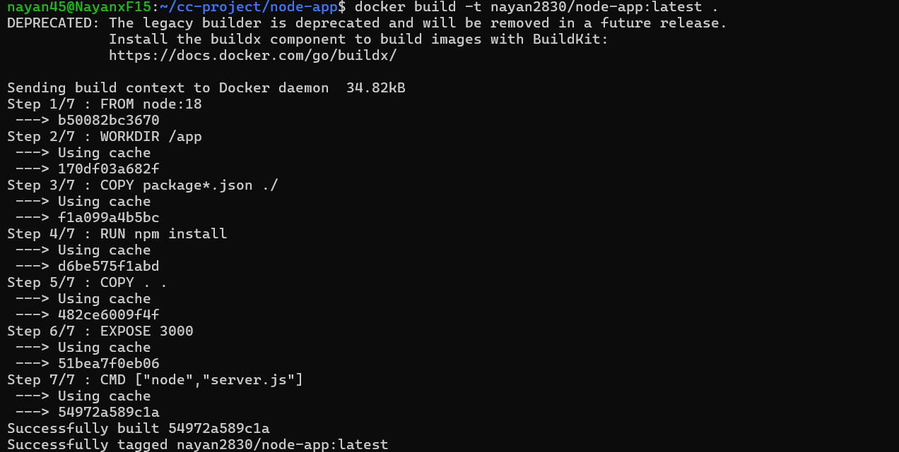
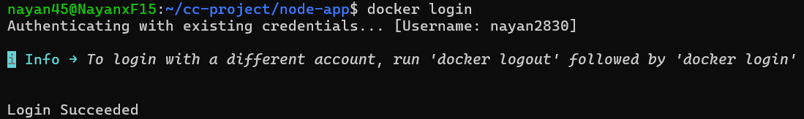
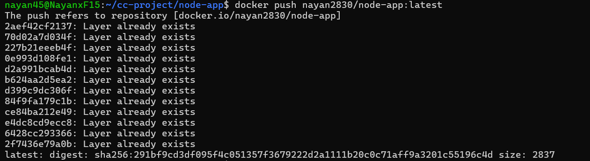
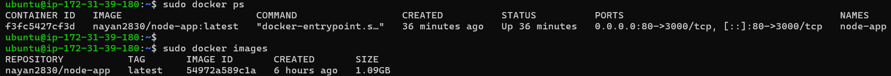

# 🚀 Cloud Computing Deployment Project

### Terraform • Ansible • Docker • AWS EC2

---

# 📌 Project Overview

This project demonstrates a complete **DevOps automated deployment pipeline** for deploying a **Node.js web application on AWS cloud infrastructure**.

The deployment is fully automated using modern DevOps tools and follows the **Build Once, Deploy Anywhere** principle.

This project follows a real-world DevOps pipeline separating build and deployment stages using Docker Hub as a registry.

---

# 🧠 Key Features

* Infrastructure provisioning using **Terraform (IaC)**
* Automated configuration using **Ansible**
* Application containerization using **Docker**
* Cloud deployment on **AWS EC2**
* Uses **Docker Hub** for image storage and reuse
* Fully automated deployment workflow

---

# 🏗 Architecture

```
Local Machine
     │
     ├── Docker Build
     ├── Docker Push (Docker Hub)
     │
     ▼
Docker Hub (Image Registry)
     │
     ▼
Terraform (IaC)
     │
     ▼
AWS EC2 + Security Group
     │
     ▼
Ansible Automation
     │
     ├── Install Docker
     ├── Pull Image
     ├── Run Container
     │
     ▼
Node.js Application
     │
     ▼
User Browser 🌐
```

---

# 📂 Project Structure

```
cc-project/
│
├── README.md
├── .gitignore
│
├── terraform/
│   ├── main.tf
│   ├── mykey.pem
│   ├── terraform.tfstate
│   └── terraform.tfstate.backup
│
├── ansible/
│   └── playbook.yml
│
├── node-app/
│   ├── Dockerfile
│   ├── package.json
│   ├── package-lock.json
│   └── server.js
│
├── screenshots/
│   ├── terraform.png
│   ├── ansible.png
│   ├── docker.png
│   └── app.png
```

---

# ⚙️ Prerequisites

Ensure the following tools are installed:

* Terraform
* Ansible
* Docker
* AWS CLI (configured)
* Git
* Linux / WSL environment

---

# 🚀 Deployment Steps

## Step 1 — Build & Push Docker Image

```bash
cd node-app
docker build -t nayan2830/node-app:latest .
docker login
docker push nayan2830/node-app:latest
```

---

## Step 2 — Provision Infrastructure using Terraform

```bash
cd terraform
terraform init
terraform apply
```

This will:

* Create EC2 instance
* Configure security group (ports 22 for SSH, 80 for web access)
* Generate Ansible inventory file

---

## Step 3 — Configure & Deploy using Ansible

```bash
cd ../ansible
ansible-playbook -i inventory playbook.yml
```

This will:

* Install Docker on EC2
* Pull Docker image from Docker Hub
* Run container on port 80

---

# 🌐 Access the Application

Open in browser:

```
http://<EC2_PUBLIC_IP>
```

---

# 🐳 Docker Details

* Image stored on Docker Hub
* Pulled during deployment
* Port mapping:

```
EC2 Port 80 → Container Port 3000
```

---

# 🔄 DevOps Workflow

```
Build (Local) → Push (Docker Hub) → Deploy (AWS EC2)
```

---

# 📸 Screenshots

### Terraform Provisioning




### Ansible Automation


### Docker Container






### Application Output


---

# 👨‍💻 Team Members

* Nayan Kesare
* Sifan Shamlewale
* Omkar Magar
* Rushikesh Pawar

---

# 🎯 Learning Outcomes

* Infrastructure as Code (IaC) using Terraform
* Configuration management using Ansible
* Containerization using Docker
* Cloud deployment on AWS
* DevOps automation practices

---

# 📜 Conclusion

This project demonstrates how modern DevOps tools can be integrated to automate application deployment efficiently. The use of Docker Hub ensures scalability, consistency, and faster deployment across environments.

---

# 📄 License

This project is developed for academic and learning purposes.
